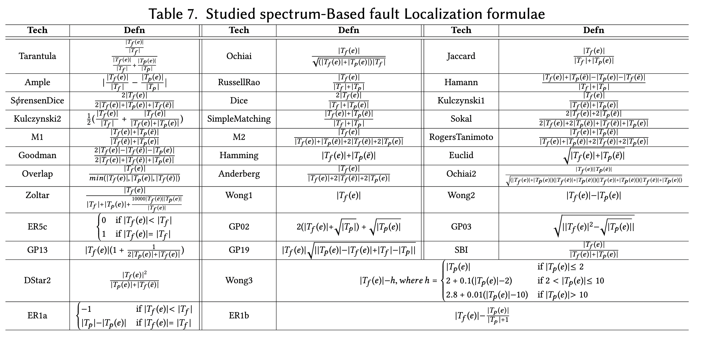

# D4jGzoltarSusList

This project uses the commonly used Gzoltar tool to generate the statement level suspicious list for 34 most widely used spectrum-based fault localization techniques on defects4j V1.2.0 projects(V1.2.0 projects in V2.0.0).

Note that the original Gzoltar does not support that much SBFL technique, the `gzoltaragent.jar` and `gzoltarcli.jar` in this repository are built from the extended version of Gzoltar (from the module `com.gzoltar.agent.rt` and `com.gzoltar.cli`), which can be found [here](https://github.com/Instein98/gzoltar/tree/sbfl).

The formulae of the 34 SBFL techniques can be found in the paper `Transforming Programs and Tests in Tandem for Fault Localization`:

